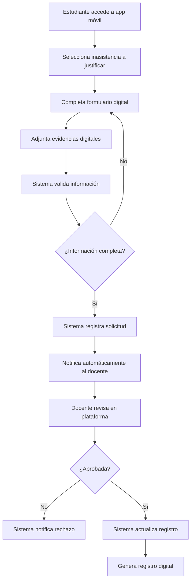
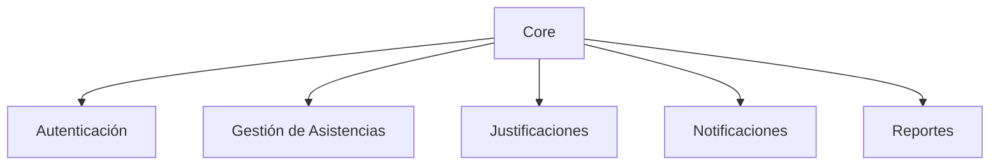
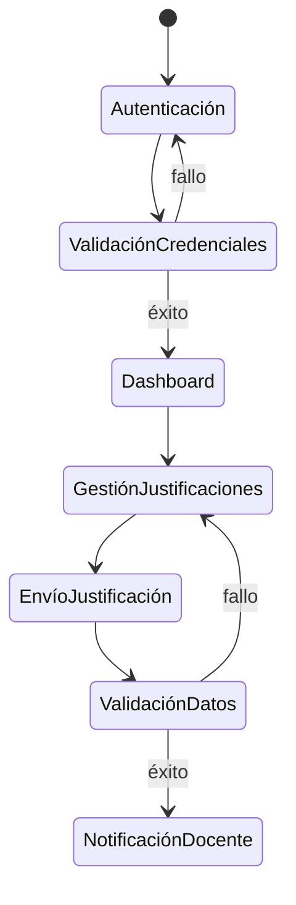
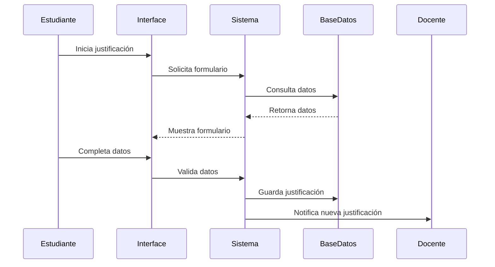
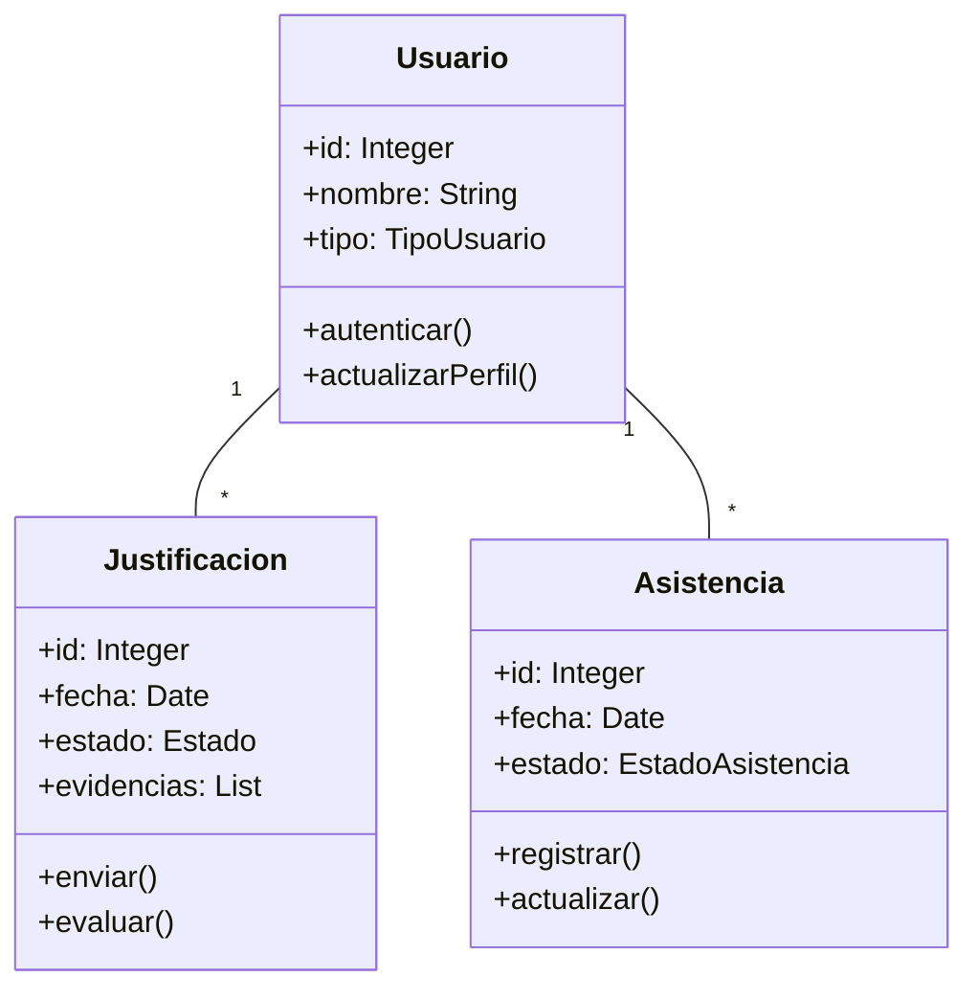

#  Proyecto “Sistema Web y Móvil para la Gestión y Justificación de Inasistencias de la Universidad Privada de Tacna”

## Integrantes
- Cesar Fabian Chavez Linares

### Diagrama con objetos

### Diagrama de Secuencia

### Diagrama de clases

